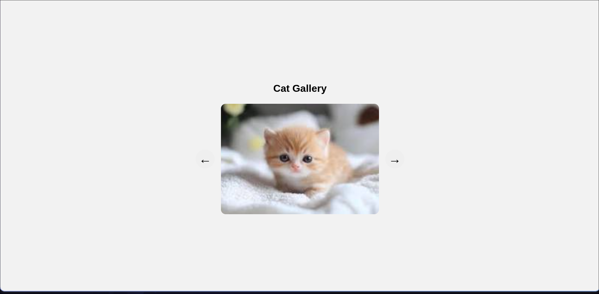

# 🐱 Cat Gallery

A simple and lightweight **Cat Gallery** website built with **HTML, CSS, JavaScript**.

Browse through a collection of cat images using the **Previous** and **Next** buttons. The gallery loops continuously, so reaching last image takes you back to the first one. 

## 🌐 Live Demo

**Github Pages:**
https://dakugaming7487.github.io/cat-gallery/


## 🛠️ Buit with

- **HTML5** - Page Structure
- **CSS3** - Styling and layout
- **JavaScript** - Image navigation and gallery logic

## 📁 Project Structure

```text
.
├── images
│   ├── cat10.jpeg
│   ├── cat11.jpeg
│   ├── cat12.jpeg
│   ├── cat13.jpeg
│   ├── cat14.jpeg
│   ├── cat15.jpeg
│   ├── cat1.jpeg
│   ├── cat2.jpeg
│   ├── cat3.jpeg
│   ├── cat4.jpeg
│   ├── cat5.jpeg
│   ├── cat6.jpeg
│   ├── cat7.jpeg
│   ├── cat8.jpeg
│   └── cat9.jpeg
├── index.html
├── LICENSE
├── README.md
├── screenshots
│   └── homepage.png
├── script.js
└── style.css

3 directories, 21 files
```

## 🚀 How It Works

The script.js file contains the logic that helps in navigations of images, it also consists of a array of image paths 

clicking the button in the left navigates backward while the right button navigates forward

## 💻 Run Locally

Clone the repository:

    git clone https://github.com/dakugaming7487/cat-gallery.git

Enter the project directory:

    cd cat-gallery

Then open `index.html` in your browser.

You can also use a local development server such as VS Code Live Server.

## 📸 Screenshots



## 📄 License

The license is **MIT License** cause there is nothing you can acctualy use in a interview

See the `LICENSE` file for more information.

## 👨‍💻 Author

Made by **Daku Gaming**(me)
